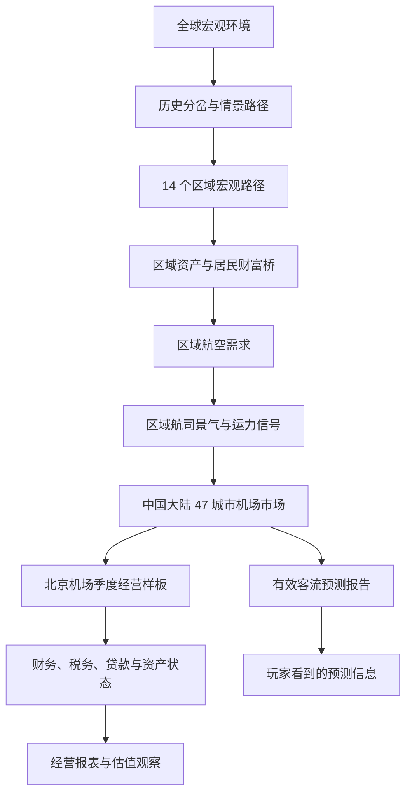

# 模型主链：一次机场模拟是怎样形成的

这篇文档只解释各层模型之间的关系。具体公式、参数和文件格式分别放在对应专题文档中。

## 一句话理解

项目先生成全球经济环境，再把它分配到各地区；地区经济决定航空需求，区域航司层提供运力趋势、信心和约束信号；城市市场再计算本地潜在客流、城市航司供给和机场实际承接量，机场经营层把这些结果转化为收入、成本、资产、负债和玩家事务。

## 各层分别回答什么问题

| 层级 | 回答的问题 | 主要输出给谁 |
| --- | --- | --- |
| 全球宏观 | 世界经济处在怎样的增长、通胀、利率、信用和资产环境中？ | 区域宏观 |
| 情景分岔 | 某个风险事件是否发生，发生后怎样改变路径？ | 全球及区域路径 |
| 区域宏观 | 14 个地区受到全球环境影响后，各自怎样增长和波动？ | 区域航空需求 |
| 区域资产与居民财富桥 | 本地 EPS、PE、股票/债券怎样形成市场、财富与现金购买力三条信号？ | 区域航空需求与商业倾向 |
| 航空需求 | 经济和人口条件支持多少航空出行需求？ | 航司供给层 |
| 区域航司供给 | 区域运力、航司信心和运营约束怎样变化？ | 城市机场市场 |
| 城市机场市场 | 区域信号怎样影响中国大陆 47 个城市，本地潜在需求、城市航司供给和实际有效客流分别是多少？ | 机场经营与预测 |
| 有效客流预测 | 不同能力等级的预测者能看到怎样的未来判断？ | 玩家信息界面 |
| 季度经营 | 客流、容量、服务质量、商业合同和项目怎样形成季度经营结果？ | 财务状态 |
| 财务状态 | 收入、成本、折旧、税务、贷款和现金怎样共同变化？ | 报表与估值观察 |

## 三种容易混淆的“客流”

1. **潜在客流**：在经济、人口和出行偏好支持下，市场希望发生的出行量。
2. **城市航司投放运力**：在区域趋势与约束背景下，本地航司准备提供的总运输能力。
3. **分客群可承接供给**：投放运力经过五类需求上限和供给优先级分配后，真正能匹配到旅客的能力；其总量仍等于潜在客流与投放运力中的较小者。
4. **机场实际承接客流**：分客群可承接供给进入经营后，再受机场容量和施工等经营约束的结果。

因此，需求很高并不等于机场一定能够承接同样高的客流。航司运力不足或机场容量不足都会形成瓶颈；同一总量下，航司怎样在商务、休闲等客群间分配，还会改变机场商业收入和成本结构。

区域层也会输出参考承接量用于对账，但它不是各城市客流总额，也不会对城市形成硬上限。

## 资产、财富和收入为什么分开

全球与区域资产会计首先区分股票价格回报、股息和总回报。区域层再将这些投资结果映射为三个下游入口：市场冲量影响商务和风险信心，居民财富冲量影响休闲与高端消费，实际可支配收入影响现金购买力。航空总量和五类客群只各读取一次资产市场、财富、现金收入、信用信心和票价成本贡献；免税与奢侈品通过高端倾向消费财富，不再重复叠加同一财富渠道。

## 真实结果与预测报告不是一回事

城市市场和机场经营链条生成模拟世界中的“真实结果”。有效客流预测则是玩家的信息层：它根据发布年份、预测能力和信息误差生成报告，并在事后接受审计。

预测报告不会反过来修改真实客流。它的作用是帮助玩家做决定，同时保留判断错误的可能性。

## Run、Viewer 与动态测试的关系

- **Run** 是一次完整模型计算，使用确定的 Seed、年数和情景参数生成一套输出。
- **Viewer** 读取已经发布的 Run，用于浏览宏观、经营和预测结果，本身不负责修改模型。
- **Seed Explorer 动态测试** 可以运行或读取指定 Seed，并让玩家按季度查看、模拟和保存北京机场经营状态。

这三者共用同一套模型与输出口径，但用途不同：Run 负责计算，Viewer 负责查看，动态测试负责交互验证。

## 当前实现边界

- 全球宏观、14 区区域宏观、区域航空需求和供给已经形成完整计算链。
- 中国大陆城市市场覆盖 47 个城市。
- 季度经营、财务、合同、项目和融资目前以北京机场为主要可操作样板。
- 有效客流预测目前也是北京样板。
- 其它国家、地区和城市尚未形成与北京同等完整的经营配置。
- 动态测试是开发与验证界面，仍可能向浏览器提供完整历史结果，不等同于最终游戏的信息隔离方案。

## 继续阅读

- [全球宏观模型](Global_Macro.md)
- [区域宏观模型](Regional_Macro.md)
- [航空与城市机场市场](Aviation_and_City_Market.md)
- [机场季度经营](Airport_Operations.md)
- [财务、合同与项目](Finance_Contracts_and_Projects.md)
- [游戏流程](../product/Game_Flow.md)
