# Airport 修整与重构指导

## 1. 文档目的

本文档用于指导 `airport` 项目的后续修整和重构。

### 当前实施状态（2026-07-11）

阶段 0 到阶段 2 的安全底座和用户入口已经完成主要事项，阶段 3 的机械拆分与阶段 4 的低风险工程化也已开始：

- 已增加固定 Seed 的九组数值 SHA-256 特征测试。
- 已增加 60 年 baseline/occurred/probabilistic 语义摘要、14 区与 47 城结构、关键 CSV 表头和一条真实融资行动回放测试。
- 已增加统一首页和四个主要页面的本地脚本资源 Smoke Test，以及五个页面关键 DOM `id` 存在且唯一的自动化契约测试。
- orchestrator 默认输出已改为基于 `airport` 根目录，不再依赖当前工作目录。
- Seed Explorer 玩家存档已从临时 Run 缓存分离到 `saves/seed_explorer/`。
- 已加入旧存档兼容迁移，现有一份旧存档已完成等字节迁移并保留原文件。
- 完整 Run 缓存指纹已升级为 v4，覆盖 Python 环境、模型脚本、配置、全部 `airport_sim/server/*.py` 服务模块和精简 artifact profile 边界。
- 查询缓存列表不再触发清理；主动清理缓存不会删除独立存档。
- Seed Explorer 的 JSON 和缓存写入已采用临时文件加原子替换。
- Viewer 发布已改为版本目录、三个页面数据包和 Manifest 原子切换；Manifest 会记录 Run、变体、Seed、起始年、年数、模型版本、输出 Schema 版本和生成时间，旧 canonical 路径继续兼容。
- 已增加发布包 SHA-256、成功切换和兼容复制失败时保持旧指针的自动化测试。
- Viewer release Manifest 已有独立 JSON Schema；统一首页会通过工作区状态接口显示 Run、变体、Seed、模型版本和发布时间。
- 已增加 `start_airport_ui.bat`、`python -m airport_sim serve`、统一首页和单端口本地服务，集中导航四个主要页面并显示当前数据状态；`python -m airport_ui` 保留为兼容薄包装。
- 原 Seed Explorer 启动脚本已改为调用统一入口；端口被未知进程占用时不再强制结束该进程。
- 已增加固定 Seed 的城市市场与北京经营 API JSON 快照。
- 完整 Macro Run 已改为 staging 生成，并校验核心 CSV 的行数、表头、列宽、Seed、年份、`year_index` 和 14 区覆盖，再原子正式化；失败不会留下半成品正式 Run。
- 已建立 `config/airport_versions.json`，Run Manifest 与 API 会返回模型、Schema 和 Python 版本。
- 已为完整 Run Manifest、Viewer release Manifest、城市市场、北京经营、玩家模拟、随机 Seed、任务进度、后台 Job 和三个 Viewer 按需加载协议建立 JSON Schema 2020-12，并提供 `/api/schema` 目录。
- 有效客流预测 Viewer 已改为轻量目录加按报告 JSON 数据块；当前默认报告首屏数据量下降约 95.5%，旧完整 JS 保留回退。
- 全球宏观 Viewer 已改为“全球主链与协调结果首屏加载、14 个区域按需加载”；12 年固定 Seed 验证中首屏发布包由约 2.64 MB 降至 0.91 MB，下降约 65.6%。
- 北京经营 Viewer 已明确数据边界：季度经营和财务状态作为首屏核心数据，估值只在打开“估值曲线”时加载；12 年验证中首屏发布包下降约 17.8%。
- Seed Explorer 的正式随机 Seed 已改为由 `/api/random-seed` 使用 Python `secrets` 生成；全球页面保留的前端模型已明确标成“浏览器近似预览”，不会写入正式 Run。
- 五个 HTML 页面已归入 `web/pages/`，CSS 和页面 JavaScript 已归入 `web/static/`；各 Viewer 已拆出 bootstrap/state，全球与北京经营已拆出 data client 和 Renderer，Seed Explorer 已按九类职责脚本拆分。
- 正式本地服务已从动态测试目录归入 `airport_sim/server/app.py`；storage、progress、run locks、HTTP、jobs、玩家存档 `SaveRepository`、城市汇总 serializers 和 validation 位于同一服务包。路由、运行/玩家服务、其余 API 序列化以及项目、合同、融资领域职责仍未全部搬出 `app.py`。
- 模型层已抽取不改变运算顺序的公共 `clamp`、`resolve_seeds`、最大行为等价组的 `round_record`、两类不同缺失值语义的 `as_float` 和 `safe_divide`；公共 `simulation_io.py` 也已覆盖现用的 UTF-8/UTF-8-SIG CSV 与 JSON 薄包装。
- 配置 JSON 已加入按文件状态自动失效的只读缓存，并通过副本隔离测试避免调用者修改缓存原件。
- 缓存列表只计算一次当前依赖指纹；依赖文件字节按路径、修改时间和大小缓存，避免反复读取未变化脚本和配置。
- Seed Explorer 已改为每个 Run 独立加锁；缓存维护使用非阻塞 Run 预留，避免清理正在写入的 Run，同时允许不同 Run 并行执行。
- 本地服务已增加结构化 JSON 日志和任务进度；可选 `POST /api/run-job` 与 `GET /api/jobs/<jobId>` 支持后台 Run，旧同步 `POST /api/run` 保持兼容。
- 本地 HTTP POST 限制为 2 MiB UTF-8 JSON，检查 Content-Type 并区分 400/403/404/409/413/415/500/503/504；默认只允许回环 Host/Origin，非回环绑定必须显式授权。
- 已增加最小 `pyproject.toml`、正确性优先的 Ruff 配置，以及 Windows/Linux、Python 3.13 的 GitHub Actions 测试矩阵。
- 已建立 `docs/architecture/Current_Architecture_and_Runtime.md`，把当前事实与未来界面合并计划分开记录。
- 已完成统一首页和四个主要页面的实际浏览器验收，并建立区域/城市并行与玩家增量重算评估文档。

尚未实施的后续重点包括继续拆分有效客流预测和少数页面装配逻辑，把 `airport_sim/server/app.py` 中的路由、运行/玩家服务、其余 API 序列化及项目/合同/融资领域规则继续按职责拆分，引入命名运行 Profile，以及把原子写入扩展到各层单模块正式输出。区域/城市并行和玩家行动增量重算已经完成技术评估，但实施继续暂缓。

核心原则是：

> 优先改善启动方式、路径、缓存、存档、前后端边界、输出管理和代码结构；在没有回归测试保护前，不修改模型公式、随机数消费顺序、浮点计算顺序和现有数值结果。

当前项目已经形成完整的模拟链条，但整体更接近持续成长中的研究型原型。现阶段最急需解决的不是计算公式，而是以下问题：

- 同一个 Seed 的结果是否来自同一套模型。
- 输出究竟写到了哪个目录。
- 页面读取的是当前结果还是旧缓存。
- 玩家存档会不会被缓存清理误删。
- 发布中断时会不会混合新旧 Run。
- 非计算机专业用户能否通过一个入口稳定运行和查看系统。

## 2. 重构约束

后续修改应遵守以下约束：

1. 先建立固定 Seed 的回归基线，再移动或拆分计算代码。
2. 不直接修改现有模型默认参数；需要统一时，先引入命名运行 Profile 并保留旧行为。
3. 不改变随机数生成器、随机数调用次数和迭代顺序。
4. 不改变浮点运算、舍入和排序顺序，除非有明确的版本升级计划。
5. 不把清理缓存等同于删除玩家存档。
6. Viewer 应优先负责展示，正式计算应只有一个权威来源。
7. 输出发布必须可追溯、可校验，最好能够原子切换。
8. 大文件拆分先做机械搬移，避免在同一次修改中重写业务逻辑。

## 3. 当前运行方式

现有系统可以分成五种运行方式。

| 方式 | 用途 | 实际运行过程 |
|---|---|---|
| 一键完整 Run | 正式生成一条世界线 | Python 总调度器依次运行全球、区域、航空、城市、经营、财务和估值层 |
| 单模块运行 | 调试某一层 | 手动指定输入 CSV，重算某个区域或机场层 |
| 统一本地首页 | 面向非技术用户导航 | 同一个本地服务提供四个页面入口和当前数据状态 |
| 静态 Viewer | 查看已有结果 | HTML 按 Manifest 读取发布包、轻量索引和 JSON 数据块；旧 canonical JS 继续兼容 |
| Seed Explorer | 动态测试和玩家操作 | 浏览器调用本地 Python API，后端重跑总链或经营、财务层 |

### 3.1 完整运行

```powershell
py -3.13 .\macro_layers\macro_run_orchestrator_sim.py --seed 20261324
```

生成后发布给 Viewer：

```powershell
py -3.13 .\macro_layers\macro_run_orchestrator_sim.py --seed 20261324 --publish-viewer baseline
```

### 3.2 单模块运行

```powershell
py -3.13 .\macro_layers\regional_aviation_demand_layer_sim.py --region china_mainland
py -3.13 .\macro_layers\regional_air_capacity_supply_layer_sim.py --region china_mainland
```

单模块主要用于调试，不应默认认为它与完整 Run 使用相同的参数口径。当前总调度器和部分单层脚本的默认参数并不一致，详见后文。

### 3.3 静态 Viewer

主要静态页面：

- `web/pages/global_gdp_viewer.html`
- `web/pages/beijing_airport_operations_viewer.html`
- `web/pages/beijing_potential_passenger_forecast_viewer.html`

这些页面主要读取 Python 预先生成的 Viewer JS 数据并在浏览器中筛选、绘图。

### 3.4 Seed Explorer

入口：

```text
dynamic_tests/seed_explorer/start_seed_explorer.bat
```

启动后会在本机运行：

```text
http://127.0.0.1:8776/
```

运行关系：

```text
浏览器页面
  -> /api/run、/api/player-simulation 等接口
  -> airport_sim/server/app.py
  -> orchestrator 或经营/财务脚本
  -> CSV/JSON/缓存
  -> 服务端汇总后返回浏览器
```

## 4. 模块关系

```mermaid
flowchart LR
    S["Seed 与运行参数"] --> O["总调度器"]

    O --> G1["全球 GDP"]
    G1 --> G2["通胀"]
    G2 --> G3["政策利率"]
    G3 --> G4["收益率曲线"]
    G4 --> G5["美元流动性"]
    G5 --> G6["信用利差"]
    G6 --> G7["资产价格"]
    G7 --> G8["石油与商品"]
    G8 --> GF["宏观反馈校准"]
    GF -. "迭代反馈" .-> G1

    G8 --> R1["14 区区域宏观"]
    R1 --> R2["区域 GDP 对账"]
    R1 --> A1["区域航空需求"]
    R2 --> A1
    A1 --> A2["航空供给与满足率"]
    R1 --> C["47 个城市机场市场"]
    A1 --> C
    A2 --> C

    C --> P["有效客流预测报告"]
    C --> Q["季度经营"]
    Q --> F["财务状态"]
    Q --> V["估值"]
    F --> V

    P --> D["CSV / JSON / Viewer 数据"]
    V --> D
    D --> SV["静态 Viewer"]

    UI["Seed Explorer 页面"] --> API["本地 Python API"]
    API -->|"完整 Seed"| O
    API -->|"玩家行动重算"| Q
```



### 4.1 有效客流预测的实际位置

有效客流预测目前是城市机场市场之后的观察分支，主要用于向玩家提供信息，并不是季度经营的输入。

实际关系是：

```text
城市机场真实数据
  ├─> 有效客流预测报告（玩家看到的信息）
  └─> 季度经营（经营主链使用的真实输入）
```

如果这是有意设计，应在架构文档和 UI 中明确，避免让人误以为“预测值决定了实际经营结果”。

## 5. P0：立即处理的事项

### 5.1 建立“运行结果不变”的保护线

基础保护线已经建立：当前有短周期九组数值摘要，60 年 baseline/occurred/probabilistic 语义摘要，14 区与 47 城结构和关键 CSV 表头契约，一条真实融资行动回放，API 快照、Run/Viewer 原子性测试、Schema 契约、页面资源 Smoke Test、五个页面关键 DOM `id` 的存在性与唯一性契约、项目级 `pyproject.toml` 和跨平台 CI。后续如果要修改玩家领域规则或增量重算，仍需补齐合同、各类项目和更多融资组合的完整回放；涉及视觉布局的前端改动仍可补截图基线。

在任何结构性重构前，应固定若干代表性 Seed，并保存以下基线：

- 全球宏观 CSV 的字段、行数和数值。
- 14 区区域宏观和 GDP 对账结果。
- 区域航空需求与航空供给结果。
- 代表性城市的机场市场结果。
- 北京有效客流预测结果。
- 北京季度经营、财务状态和估值结果。
- Seed Explorer API 的 JSON 快照。
- 四个页面的资源加载 Smoke Test。
- 五个页面关键 DOM `id` 的存在性与唯一性契约。

建议至少包含：

```text
短周期固定 Seed
60 年固定 Seed
baseline
occurred scenario
probabilistic scenario
北京玩家无行动
北京包含合同、项目和融资行动
```

比较时可以忽略：

- 时间戳。
- 绝对路径。
- 机器相关元数据。

应严格比较：

- 数值。
- 字段名称和字段顺序。
- 行数和排序。
- Seed、年份和场景标识。
- 汇总指标。

### 5.2 修正默认输出路径

改造前，README 要求在 `airport` 目录运行：

```powershell
py -3.13 .\macro_layers\macro_run_orchestrator_sim.py
```

当时 orchestrator 默认输出使用相对路径：

```text
airport/output/macro_runs
airport/output
```

因此曾可能产生：

```text
C:\d_e\oiltanker\airport\airport\output
```

Viewer 实际读取的是：

```text
C:\d_e\oiltanker\airport\output
```

Viewer 则读取根目录下另一套输出，造成同一工作区出现两套结果。

已实施的处理：

- 所有默认输出路径都基于 `Path(__file__).resolve()` 计算。
- 不再依赖当前工作目录。
- 在文档中说明旧 `airport/airport/output` 的来源和保留原则。
- 暂时兼容显式传入旧路径的命令。
- 不自动删除旧目录，迁移前先确认其中是否有需要保留的 Run。

当前默认路径已经基于 `Path(__file__).resolve()` 计算，不再依赖当前工作目录；显式传入的旧路径仍受支持，旧嵌套目录不会被自动删除。这项修改不改变任何数值，只改变结果文件的正确落点。

### 5.3 分离玩家存档和临时缓存

改造前，Seed Explorer 存档位于 Run 缓存目录内，清理旧缓存或强制重算时存在一起删除的风险。当前玩家存档已经迁移到独立的 `saves/seed_explorer/`，临时 Run 缓存继续位于 `output/seed_explorer_runs/`。

建议目录结构：

```text
output/
  seed_explorer_runs/
  macro_runs/
  viewer_releases/
saves/
  seed_explorer/
```

规则：

- `cache/` 可以根据空间或数量自动删除。
- `macro_runs/` 是归档结果，应按明确策略清理。
- `saves/` 是玩家持久存档，除非用户确认，否则不能删除。
- GET 查询接口不应触发删除操作。
- 存档使用临时文件写完后原子替换，避免中断产生半个 JSON。

以上规则已经实施，并保留旧存档发现与兼容迁移；GET 缓存查询不会触发清理。

### 5.4 给缓存加入版本指纹

缓存目录仍以 `seed + years` 作为便于识别的名称，但是否复用不再只看文件存在。缓存 Manifest 已记录模型脚本、配置和 Python 环境指纹；任一计算依赖变化后会自动拒绝旧缓存并重算。当前指纹版本为 `seed-explorer-run-cache-v4`，依赖集合包含全部 `airport_sim/server/*.py`，所以后续抽出的服务模块发生变化时也不会误用旧缓存；自动化测试会检查这些拆分模块没有漏出指纹范围。

缓存 Manifest 至少应记录：

```text
seed
years
start_year
run_profile
orchestrator_version
Python version
相关脚本 hash
相关配置 hash
输出 schema version
生成时间
```

任一计算依赖发生变化时，应自动判定缓存失效，并在页面显示：

```text
缓存命中
缓存因模型版本变化失效
缓存因配置变化失效
正在重新计算
```

当前已能区分缓存命中、失效后重算和任务进度；把“代码变化”与“配置变化”进一步拆成更细的用户文案仍可后续增强。

### 5.5 消除前端和 Python 两套宏观模型

全球 Viewer 的页面脚本 `web/static/js/global-gdp/page.js` 不仅展示结果，还保留一套 JavaScript 宏观模拟、情景分岔和随机 Seed 生成逻辑。

当前实际存在：

```text
Python canonical 正式模型
JavaScript 浏览器动态模型
```

两套实现会随着开发逐渐产生差异。

目标结构应是：

```text
浏览器负责输入和展示
本地 Python 服务负责正式计算
```

建议分阶段处理：

1. 固定同 Seed 的 Python/JavaScript 对比测试。
2. 短期把浏览器版标记为“快速近似预览”。
3. 增加本地 API，为宏观 Viewer 提供正式随机 Seed 计算。
4. 确认功能迁移完毕后，移除前端重复公式。

当前进度：正式随机 Seed 已由 Python 服务生成；浏览器模型已经明确标成近似预览并与正式 Run 隔离。全球 Viewer 如果未来需要直接创建正式随机世界线，应调用 Python Run API；在功能完全迁移前继续保留预览公式，不把它冒充 canonical 结果。

### 5.6 统一运行参数口径

当前总调度器默认：

```text
initial_gdp = 100.0
volatility_scale = 1.0
```

部分单层 CLI 默认：

```text
initial_gdp = 110.0
volatility_scale = 1.55
```

因此同一个 Seed 通过“完整运行”和“单层运行”得到的并不是同一个世界。

不要直接修改旧默认值。建议先引入命名运行 Profile：

```text
orchestrator_v05
legacy_single_layer
seed_explorer_default
```

每个 Run Manifest 必须记录所使用的 Profile 和展开后的全部参数。

### 5.7 让输出发布具备原子性

这项风险已经在第一阶段处理。`--publish-viewer` 现在先生成版本化数据包，再切换 Viewer 指针；canonical 目录只作为旧页面和外部脚本的兼容输出。

风险包括：

- 发布中断后页面读取到半套新数据。
- 新配置减少城市或区域时，旧文件仍残留。
- 多个页面可能同时读取不同 Run 的数据。

建议结构：

```text
output/viewer_releases/<release_id>/
output/current_viewer_manifest.json
output/current_viewer_manifest.js
```

当前发布流程：

1. 在 `.staging_<release_id>` 中写入全球、北京经营、北京预测三个 Viewer 数据包。
2. 计算每个数据包的 SHA-256，并把 staging 目录原子改名为正式 release。
3. 刷新 canonical 兼容目录；这一步失败时保持旧 Viewer 指针不变。
4. 原子写入 JSON 元数据，并最后原子替换浏览器实际读取的 `current_viewer_manifest.js`。
5. 三个静态 Viewer 始终根据同一个 Manifest 读取同一 release；没有 Manifest 时回退旧 canonical 数据。

release Manifest 会写入 Run、变体、Seed、起始年、年数、模型版本、输出 Schema 版本和生成时间，并由 `viewer-release-manifest.schema.json` 验证结构。统一首页读取 `/api/workspace-status` 后展示其中的 Run、变体、Seed、模型版本和发布时间，用户不必从输出目录猜测页面当前使用哪次发布。

完整 Run 校验已经从行数扩展到表头、列宽、Seed、年份、`year_index` 和 14 区覆盖。仍可继续增强的部分是 release 保留策略，以及把相同原子写入模式扩展到各模型层的单模块正式 CSV/JSON 输出。

## 6. P1：高收益结构优化

### 6.1 提供统一的一键启动入口

这项工作已经完成。Windows 用户可以双击：

```text
start_airport_ui.bat
```

启动后访问 `http://127.0.0.1:8776/`，本地首页提供：

```text
全球宏观看板
北京机场经营
有效客流预测
Seed Explorer
运行记录与发布状态
```

同一个本地服务当前负责：

- 托管统一首页和四个主要页面。
- 提供 Seed Explorer JSON API 与工作区状态 API。
- 触发既有 Seed 模拟任务。
- 显示 Viewer 发布模式、缓存数量和存档数量。
- 继续使用已分离的缓存与存档目录。

服务默认绑定 `127.0.0.1`。启动前会验证 8776 端口上的服务身份；如果端口属于其他程序，只提示用户处理，不会自动结束进程。`stop_airport_ui.bat` 也会同时校验健康接口、PID 和命令行后才停止服务。非回环地址必须显式授权，不属于普通一键入口。

跨平台命令也已经提供，并复用同一个服务入口：

```powershell
python -m airport_sim serve
```

### 6.2 Viewer 按需加载数据

按需加载改造前的基线实测：

- 全球 Viewer 引用约 53 个外部数据脚本，已有文件合计约 25 MB。
- 北京有效客流预测的单个 Viewer 数据脚本约 36 MB。
- 北京经营页面的三个数据脚本约 5.5 MB。
- `output` 当前约 619 MB。
- 其中 JS 数据约 471 MB。
- 整理前 Seed Explorer 的 4 个旧缓存 Run 约 460 MB；当前已清除失效缓存，新 Run 使用精简 `seed-cache` profile，并默认只保留最近 2 个有效 Run。

建议：

- 初始只加载当前页面真正需要的数据。
- 切换区域时再加载该区域。
- 切换报告时再加载对应报告。
- Viewer 使用精简字段，不携带页面从未使用的调试字段。
- 使用带 Schema 的 JSON，而不是大量 `window.*` 可执行 JS。
- 本地 HTTP 服务支持 gzip/Brotli、ETag 和缓存控制。
- 归档数据和展示数据分开生成。

当前进度：有效客流预测已按报告拆分；全球宏观页面已按区域拆分三组数据；北京经营页面已把估值从首屏核心包中分离。旧完整 JS 仍作为兼容回退，所以磁盘占用尚未按首屏比例同步下降。具体结构与兼容策略见 `docs/architecture/Forecast_Viewer_Lazy_Loading.md`、`docs/architecture/Global_Viewer_Lazy_Loading.md` 和 `docs/architecture/Operations_Viewer_Lazy_Loading.md`。

### 6.3 拆分超大前端文件

CSS 和页面 JavaScript 外移后，前端又完成了一轮职责拆分：

| 页面 | 已拆出的主要职责 | 仍可继续整理 |
|---|---|---|
| 统一首页 | 独立 CSS 与 page | 当前规模很小 |
| 全球宏观 | bootstrap、state、data client、formatters、preview model、controls、renderers | 少量页面装配与组件边界 |
| 北京经营 | bootstrap、state、data client、renderers、page | Renderer 内部还可按图表类型细分 |
| 有效客流预测 | bootstrap、state、page | data client 与 Renderer 仍在 page 中 |
| Seed Explorer | 共享 API client、state、core，以及财务/设施/债务/商业/行动/经营渲染/城市渲染等九类职责脚本 | `page.js` 中剩余装配和交互 |

不必为了拆分而立即引入 React 或 Vue。可以继续使用原生 JavaScript，先整理为：

```text
viewer/
  index.html
  styles/
  api/
  state/
  charts/
  components/
  pages/
```

当前已完成 CSS、主 JavaScript、状态、API 边界和主要 Renderer 的机械拆分。后续只继续处理仍然过大的职责，不为追求目录数量而拆分小文件：

1. 有效客流预测搬出 data client 和 Renderer。
2. Seed Explorer 从 `page.js` 继续搬出剩余页面装配和交互。
3. 只在接口稳定后再调整组件职责。

本轮已经运行固定 Seed、资源 Smoke Test 和实际浏览器验收，验证统一首页与四个主要页面、关键切换和按需加载；同时已增加五个页面关键 DOM `id` 存在且唯一的自动化契约。该测试保护 JavaScript 依赖的稳定挂载点，但不检查颜色、尺寸、布局或图表外观，因此仍不能把它表述为完整截图视觉回归系统。

### 6.4 拆分 Seed Explorer 服务端

正式服务已经从动态测试目录归入 `airport_sim/server/app.py`，并把公共基础设施与部分边界职责放在同一个服务包：

```text
airport_sim/server/
  app.py
  storage.py
  progress.py
  run_locks.py
  http.py
  jobs.py
  repository.py    # 玩家存档 SaveRepository
  serializers.py   # 城市结果汇总 serializers
  validation.py
```

`app.py` 仍同时负责：

- HTTP 路由。
- 输入清洗。
- 项目、合同和融资规则。
- 存档、缓存和 Run 的业务编排（存档路径、迁移、读取、清理和摘要已委托给 `SaveRepository`）。
- 子进程调用。
- CSV 汇总（城市结果摘要已委托给 serializers）。
- 其余 API 序列化。

建议拆分为：

```text
airport_sim/server/
  app.py
  routes.py
  services/
    run_service.py
    player_simulation_service.py
  repositories/
    cache_repository.py
    save_repository.py
  domain/
    projects.py
    contracts.py
    financing.py
  serializers.py
```

先机械搬移现有函数，通过 API 快照验证 JSON 不变。

当前进度：正式服务和 helper 已归入 `airport_sim/server/`，旧 `dynamic_tests/seed_explorer/seed_explorer_server.py` 保留兼容转发；玩家存档的 `SaveRepository` 与城市结果汇总 serializers 已在独立模块中。路由、运行服务、玩家模拟服务、缓存仓储、其余 API 序列化和项目/合同/融资领域规则仍待拆分；因此只能表述为“正式归位与基础设施拆分完成”，不能声称已经完成完整的 routes/services/repositories/domain 分层。

### 6.5 建立正式前后端数据协议

所有 Viewer/API 数据建议包含：

```json
{
  "schemaVersion": "...",
  "runId": "...",
  "seed": 20261324,
  "modelVersion": "...",
  "generatedAt": "...",
  "data": []
}
```

需要明确区分：

- 模型计算结果。
- 页面展示文案。
- 配置参数。
- 调试字段。
- 汇总字段。

缺少必需字段时应明确报错，避免静默回退到页面中的另一套硬编码默认值。

当前 release Manifest 已补齐 Run/变体、Seed、起始年、年数、模型版本、输出 Schema 版本和生成时间元数据，并有独立 JSON Schema；统一首页已经显示其中最重要的 Run、变体、Seed、模型和发布时间。各 Viewer/API 的字段命名和 `data` 包装仍有历史差异，因此这一步代表发布边界已建立，不代表所有前后端协议已经统一成同一种 Envelope。

### 6.6 改善任务、日志和并发管理

长任务建议改成后台 Job：

```text
创建任务
  -> 返回 job_id
  -> 页面轮询进度
  -> 完成后加载结果
```

进度阶段可以是：

```text
全球宏观
区域宏观
区域对账
区域航空
城市机场
季度经营
财务与估值
写入输出
```

日志至少记录：

```text
run_id
seed
layer
start/end time
duration
row_count
cache_hit
model/config fingerprint
error type
```

锁建议从一个全局锁改为每个 `run_id` 一把锁：

- 不同 Run 可以并行。
- 同一个 Run 不能并发删除或写入。
- 缓存清理、存档和玩家行动重算进入同一个 Run 生命周期管理。

当前进度：结构化 JSON 日志、内存任务进度、`/api/task-status` 和每 Run 锁已经完成；缓存清理会先非阻塞预留目标 Run，不能取得锁时跳过。可选 `POST /api/run-job` 会返回 `jobId`，随后可通过 `GET /api/jobs/<jobId>` 查询；活动的相同 Run 与 `force` 语义会去重，普通请求与强制重算不会误合并，排队和运行任务合计最多 16 个。旧同步 `/api/run` 继续保留。后台 Job 改善 HTTP 等待体验，不代表一个 Run 内部的模型层已经并行。

### 6.7 输出保留和清理策略

建议把输出分为：

```text
临时缓存
正式归档 Run
当前 Viewer 发布版本
玩家存档
测试输出
```

每类使用不同策略：

| 类型 | 是否自动删除 | 建议策略 |
|---|---|---|
| 临时缓存 | 是 | 按空间上限和最近使用时间清理 |
| 正式 Run | 谨慎 | 用户确认或明确归档策略 |
| Viewer 发布版本 | 是 | 保留当前版本和若干历史版本 |
| 玩家存档 | 否 | 仅用户明确删除 |
| 测试输出 | 是 | 测试结束后自动清理或写临时目录 |

## 7. P2：有回归测试后再做

### 7.1 抽取公共 Python 工具

目前多个模块仍重复实现：

- `clamp`
- `round_record`
- `read_csv` / `write_csv`
- `read_json` / `write_json`
- `resolve_seeds`
- `as_float`
- Viewer JS 写出函数

建议逐步建立：

```text
airport_sim/common/
  math_utils.py
  io_utils.py
  seed_utils.py
  schema_utils.py
```

为降低风险，可先保留旧函数作为薄包装，内部调用公共实现。

当前进度：17 个模型模块已经共用 `macro_layers/simulation_utils.py` 中的 `clamp`，10 个模型模块已经共用相同行为的 `resolve_seeds`，行为完全相同的最大 `round_record` 组也已抽取；语义不同的 `round_record` 继续留在原模块。`simulation_utils.py` 还增加了两类明确命名的 `as_float`：一类会把缺失时的默认值也转换成 `float`，另一类直接返回缺失默认值并保留其类型；预测和估值层共用的 `safe_divide` 也已抽取。`simulation_io.py` 已扩展为兼容现有 UTF-8/UTF-8-SIG、忽略或追加额外 CSV 字段、以及不同 JSON 参数名的薄包装，并有编码、字段顺序与失败行为测试。Seed Explorer 的文件与 JSON 工具已搬到 `airport_sim/server/storage.py`。不同模块的舍入位数、Viewer JS 格式和少量特有 IO 契约仍不完全相同，因此其余工具继续逐项抽取，不能一次性统一行为。

### 7.2 整理为正式 Python 包

当前已增加最小 `pyproject.toml`，明确：

- 最低 Python 版本。
- 当前没有第三方运行依赖，主要使用标准库。
- Ruff 先只启用会影响正确性的规则，暂不对大模型文件做风格重写。
- 覆盖率工具应统计的源码目录和排除目录。

同时已增加 Windows/Linux、Python 3.13 的 GitHub Actions 测试矩阵，并已提供正式 `airport_sim` 包。`python -m airport_sim` 统一承载完整 Run、本地服务、配置校验和缓存生命周期；`python -m airport_ui` 与 Windows BAT 保留为兼容薄包装。当前可用入口：

```powershell
python -m airport_sim run --seed 20261324
python -m airport_sim serve
python -m airport_sim validate-config
python -m airport_sim cache plan
```

### 7.3 缓存配置读取

Seed Explorer 已对一次运行中反复读取的 JSON 配置按解析路径、修改时间和文件大小缓存，并在文件变化后自动失效。每次读取返回深拷贝，避免业务代码修改共享缓存对象。缓存列表只计算一次当前模型/配置指纹；指纹依赖文件的字节也按路径、修改时间和大小缓存。后续如果遇到保留时间戳且同大小覆盖文件的特殊工作流，可再升级为内容哈希键。

### 7.4 并行计算区域和城市

14 个区域以及部分城市在上游数据准备完成后具有并行空间。

并行前必须验证：

- 各模块使用独立随机数对象。
- 不修改共享输入。
- 输出排序固定。
- 序列化顺序固定。
- 并行前后固定 Seed 输出完全一致。

第一轮技术评估已经完成：区域和城市存在理论并行边界，但 Windows spawn、模块重复导入、大列表序列化、内存峰值和固定顺序汇总可能抵消收益。当前串行结果已有稳定确定性契约，尚无普通 Windows 环境下的实测证据证明多进程值得引入，因此实施暂缓。详见 `docs/refactoring/Performance_and_Incremental_Evaluation.md`。

### 7.5 玩家行动后的增量重算

当前玩家行动变化后，会重新运行完整季度经营和财务路径。理论上可以从最早受影响季度开始增量重算，但以下状态都有路径依赖：

- 折旧。
- 贷款余额和利息。
- 税损结转。
- 合同续签。
- 项目建设和投产。
- 现金和资产负债表。

因此这项优化收益较高、风险也最高，应放在最后，并为每种行动建立完整回放测试。

第一轮技术评估已经完成：正确增量起点必须恢复现金、资产与折旧、贷款、税损、合同、项目、容量、维护年龄等完整状态。当前没有版本化季度状态恢复接口，完整重算成本仍可接受，因此实施暂缓。`allQuarters` 只用于**没有新行动时**在前端推进或回看季度；一旦玩家产生新行动，仍由服务端完整重算。详见 `docs/refactoring/Performance_and_Incremental_Evaluation.md`。

### 7.6 前端局部更新

滑块、鼠标移动、窗口缩放和搜索输入不应每次重建整个页面。可以使用：

- `requestAnimationFrame` 节流。
- 局部更新选中标记和数字。
- 缓存不变的图表结构。
- 大表格虚拟化。

显示结果应保持不变。

当前 `allQuarters` 已避免无新行动的季度前后切换反复请求服务端。这是前端复用已加载结果，不是玩家行动后的模型增量重算。

## 8. 安全与稳定性补充

### 8.1 本地服务边界

默认绑定 `127.0.0.1` 继续保持。当前已经实施：

- 非回环地址必须显式使用 `--allow-non-loopback`，普通启动不能意外暴露到局域网。
- 默认本地模式检查回环 `Host` 和 `Origin`。
- POST 只接受 UTF-8 `application/json`，请求体上限为 2 MiB。
- 400、403、404、409、413、415、500、503、504 使用可理解消息和稳定错误代码。
- 服务端记录具体异常类型，普通 500 响应不返回完整内部错误。
- JSON 和静态响应使用 `X-Content-Type-Options: nosniff`。

仍可继续增强 CSP、ETag、静态资源精细缓存控制和可选压缩。严格 CSP 应等剩余内嵌发布引导脚本处理后再启用。

### 8.2 启动脚本不要误杀进程

这项风险已经处理。当前启动脚本会校验健康接口和服务身份；停止脚本还会核对 PID 与进程命令行。无法确认 8776 端口属于本项目时只提示用户处理，不会直接结束未知进程。

### 8.3 隐藏未来数据

Seed Explorer 服务端虽然描述为只暴露当前季度以前的历史，但响应中仍包含完整 `allQuarters`。

需要明确产品定位：

- 如果 Seed Explorer 只是调试器，可以保留，但必须在文档标明未来数据可见。
- 如果它准备成为正式游戏界面，应把未来数据留在后端，只按季度返回当前可见历史和必要摘要。

## 9. 文档修整

本轮已经修正以下主要漂移：动态测试与玩家闭环的完成状态、预测和季度经营的分支关系、缓存与存档的生命周期，以及当前统一入口。

当前架构的唯一事实来源是：

```text
docs/architecture/Current_Architecture_and_Runtime.md
```

其中只描述当前已经运行的结构；区域/城市并行与玩家增量重算的已评估暂缓结论记录在 `docs/refactoring/Performance_and_Incremental_Evaluation.md`；未来界面合并放在 `docs/plans/Post_Refactor_UI_Consolidation_Plan.md`，更长期的模型与游戏规划继续留在各 Roadmap。以后修改入口、目录或 API 边界时，应先同步当前架构文档。

## 10. 推荐实施顺序

### 阶段 0：冻结结果

- [x] 选择固定 Seed 和 baseline 代表性场景。
- [x] 保存核心层的标准化数值摘要和 SHA-256 特征。
- [x] 增加完整 CLI Manifest 契约和 API JSON 快照。
- [x] 建立数值回归测试。
- [x] 建立页面资源 Smoke Test。
- [x] 记录当前 Python 和模型版本。

### 阶段 1：修复运行与数据安全

- [x] 修复默认输出路径。
- [x] 为旧嵌套输出提供保留和迁移说明。
- [x] 分离存档和缓存。
- [x] GET 查询不再触发清理。
- [x] 缓存加入代码、配置和 Python 环境指纹；v4 覆盖全部 `airport_sim/server/*.py` 服务模块与精简 Run profile。
- [x] Seed Explorer JSON/缓存写入改为临时文件加原子替换。
- [x] 完整 Run 通过 staging、行数/表头/列宽/Seed/年份/14区校验和目录改名实现原子正式化。
- [x] Viewer 发布改为版本目录加 Manifest 切换。
- [x] Viewer release Manifest 补齐运行元数据、正式 Schema，并由统一首页显示关键版本信息。

### 阶段 2：统一用户入口和前后端边界

- [x] 新增统一的一键启动入口。
- [x] 增加 `python -m airport_ui` 跨平台入口。
- [x] 提供本地首页。
- [x] 将五个 HTML 页面归入 `web/pages/`，并将静态资源归入 `web/static/`，保持 HTTP 路由不变。
- [x] 将正式本地服务归入 `airport_sim/server/app.py`，保留旧动态测试脚本兼容入口。
- [x] 有效客流预测 Viewer 改为按报告加载。
- [x] 全球宏观 Viewer 按区域加载宏观、航空需求和运力供给数据。
- [x] 北京经营 Viewer 将估值数据改为打开估值曲线时加载。
- [x] 建立正式 JSON Schema。
- [x] 正式随机 Seed 统一由 Python 服务生成。
- [x] 全球页面保留的浏览器模型明确标为近似预览，不写入正式 Run。
- [x] 增加 2 MiB JSON 请求边界、Content-Type/本地来源检查和分类错误响应。

### 阶段 3：拆分大文件

- [x] 拆分 Viewer CSS。
- [x] 将页面主 JavaScript 原样搬出 HTML。
- [x] 拆出通用 bootstrap/state/API client，以及全球与北京经营 Renderer。
- [x] 将 Seed Explorer 按状态、核心和经营子域拆成九类职责脚本。
- [ ] 继续拆分有效客流预测 data client/Renderer 和少量页面装配逻辑。
- [x] 将 Seed Explorer storage/progress/run locks/HTTP/jobs 搬出服务主文件。
- [x] 抽出 Seed Explorer 玩家存档 `SaveRepository` 与城市结果汇总 serializers。
- [ ] 继续拆分 Seed Explorer 路由、运行/玩家服务、缓存仓储、其余 API 序列化和领域规则。
- [x] 扩展公共 `simulation_io`，并抽出两类 `as_float` 与 `safe_divide`，保留原编码、默认值和失败语义。
- [ ] 继续逐项抽取剩余公共 IO 和数学工具（`clamp`、`resolve_seeds`、最大等价 `round_record` 组及上述工具已完成）。
- [x] 每一步运行固定 Seed、资源 Smoke Test 和实际浏览器验收。
- [x] 增加五个页面关键 DOM `id` 存在且唯一的自动化契约。
- [ ] 对确有视觉风险的页面增加截图视觉基线。

### 阶段 4：性能和工程化

- [x] 缓存配置读取并在配置变化后自动失效。
- [x] 缓存列表复用单次指纹，依赖字节按文件状态缓存，并用 v4 契约覆盖正式服务模块。
- [x] 增加结构化日志和可查询任务进度。
- [x] 增加可选后台 Run Job，同时保留旧同步接口。
- [x] 改为每 Run 锁，并让缓存清理跳过活动 Run。
- [x] 完成区域和城市并行技术评估；实施暂缓。
- [x] 完成玩家行动增量重算技术评估；实施暂缓。
- [x] 增加 `pyproject.toml`、测试、基础格式检查和 CI。
- [x] 修整架构与运行文档。

## 11. 暂不建议的做法

在前述保护措施完成前，不建议：

- 直接改变模型公式或默认参数。
- 同时重写前端框架和后端结构。
- 直接删除 `airport/airport/output`。
- 在没有指纹的情况下继续长期复用缓存。
- 为追求速度改变随机数或浮点计算顺序。
- 立即实现路径依赖很强的增量重算。
- 把测试输出、正式 Run、Viewer 发布和玩家存档继续放在同一生命周期中。

## 12. 完成标准

本轮修整可以在达到以下标准后视为完成：

- 从任意工作目录启动都写入同一个正确的输出根目录。
- 同一 Seed、同一 Profile、同一版本始终得到相同数值结果。
- 页面能够明确显示当前 Run、Seed、模型版本和数据生成时间。
- 缓存过期时自动重算，不显示旧模型结果。
- 清理缓存不会删除玩家存档。
- Viewer 发布不会出现新旧 Run 混合。
- 统一首页和四个主要页面通过自动化 Smoke Test。
- Python 和前端大文件已按职责拆分，但计算结果保持一致。
- 项目具有统一的一键启动入口和面向非技术用户的错误提示。
